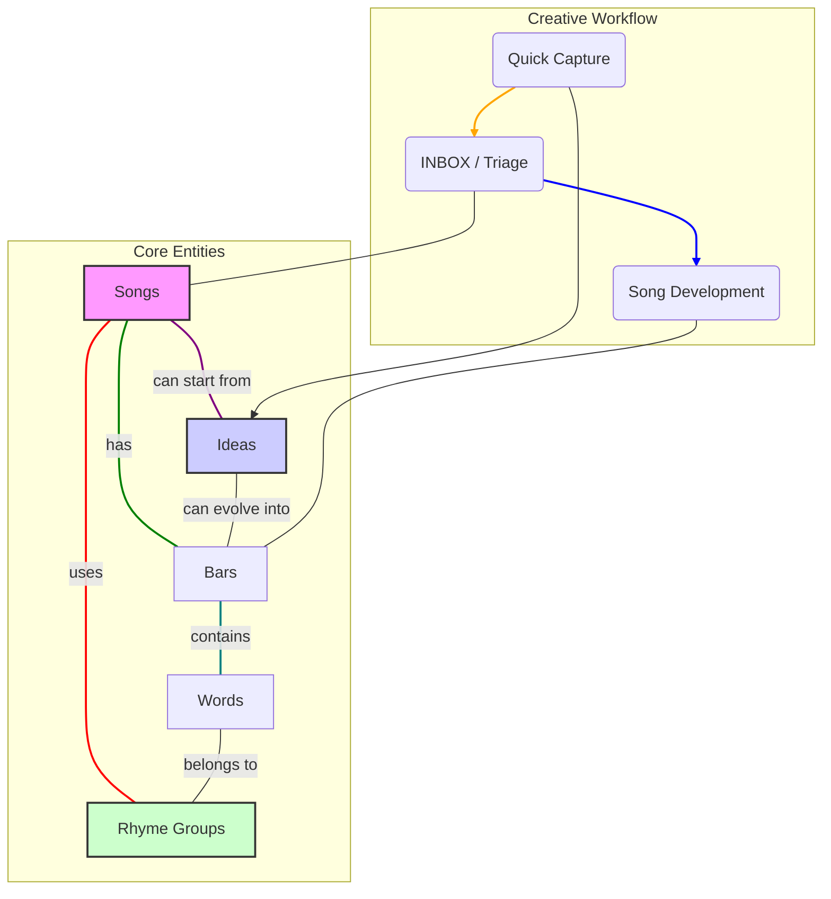

### Explanation

*   **Songs**: This is the central hub. A song is composed of `Bars` and `Ideas`, and it utilizes `Rhyme Groups`.
*   **Ideas**: The starting point. A raw thought or concept that can be developed into `Bars` or linked to a `Song`. This is your "inbox".
*   **Bars**: The actual lines of a song. They are made up of `Words`.
*   **Words**: The building blocks. Each word belongs to a phonetic `Rhyme Group`.
*   **Rhyme Groups**: Groups of words that *sound* alike, based on a phonetic key, not just spelling.

This structure supports the desired workflow:
1.  **Capture** an `Idea`.
2.  **Triage** the idea, possibly assigning it to a `Song`.
3.  **Develop** the idea into `Bars` within the context of that `Song`.
4.  The system helps you find rhymes by connecting `Words` to `Rhyme Groups` automatically. 